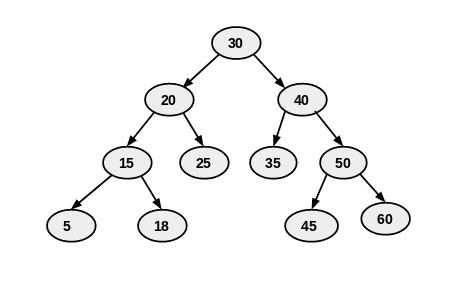

# Tree module
In this module you're going to find concepts and practices about Trees

### BinarySearchTree
Key concepts:  
- A Tree is a data structure used to store **non-linear** data in contrast to Lists or Arrays where the values are stored
  in a linear structure.
- A **Binary Search Tree (BST)** is a type of tree where its nodes have 2 child nodes as maximum:
  
- There are 3 ways to traverse a BST:
    - **InOrder** traversal: left, root, right   
      - we start recursive call from 30(root) then move to 20 (20 also have sub tree so apply in order on it),15 and 5.
      - 5 have no child .so print 5 then move to it's parent node which is 15 print and then move to 15's right node which is 18.
      - 18 have no child print 18 and move to 20 .print 20 then move it right node which is 25 .25 have no subtree so print 25.
      - print root node 30 .
      - now recursively traverse to right subtree of root node . so move to 40. 40 have subtree so traverse to left subtree of 40.
      - left subtree of 40 have only one node which is 35. 35 had no further subtree so print 35. move to 40 and print 40.
      - traverse to right subtree of 40. so move to 50 now have subtree so traverse to left subtree of 50 .move to 45 , 45 have no further subtree so print 45.
      - move to 50 and print 50. now traverse to right subtree of 50 hence move to 60 and print 60.
      - our final output is {5 , 15 , 18 , 20 , 25 , 30 , 35 , 40 , 45 , 50 , 60}
    - **PreOrder** traversal: root, left, right.  
      (The _root_ is visited first, then the _left_ subtree and finally the _right_ subtree)
    - **PostOrder** traversal: left, right, root.  
      (The _left_ subtree is visited first, then the _right_ subtree and finally the _root_)
      
Example and information taken from [HERE](https://iq.opengenus.org/binary-tree-traversals-inorder-preorder-postorder/)